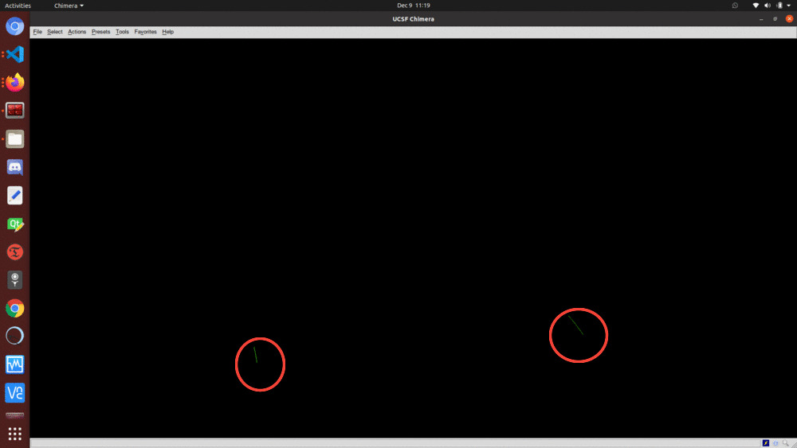
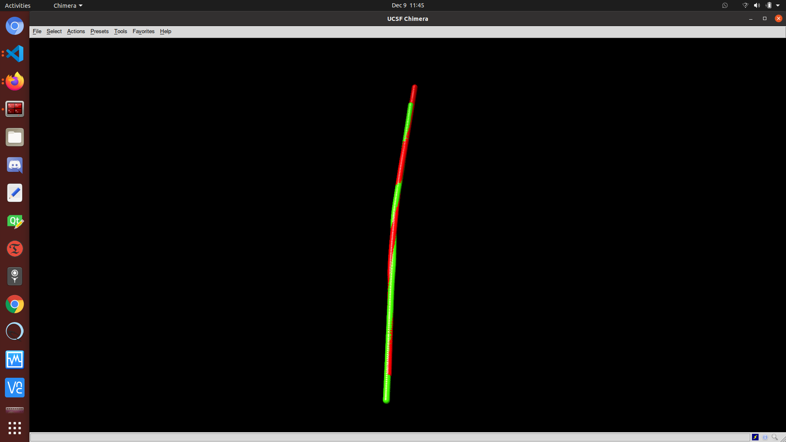
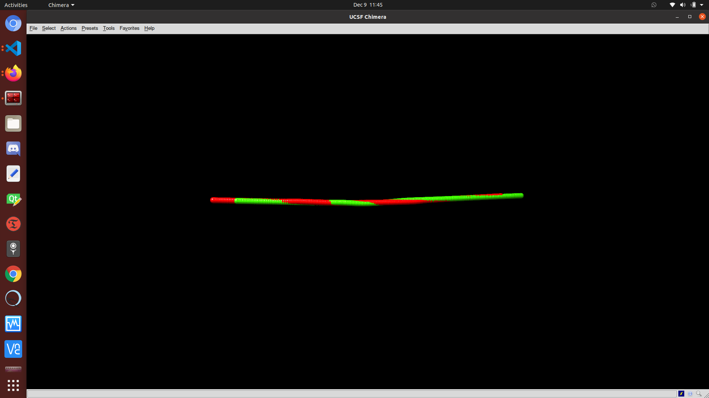
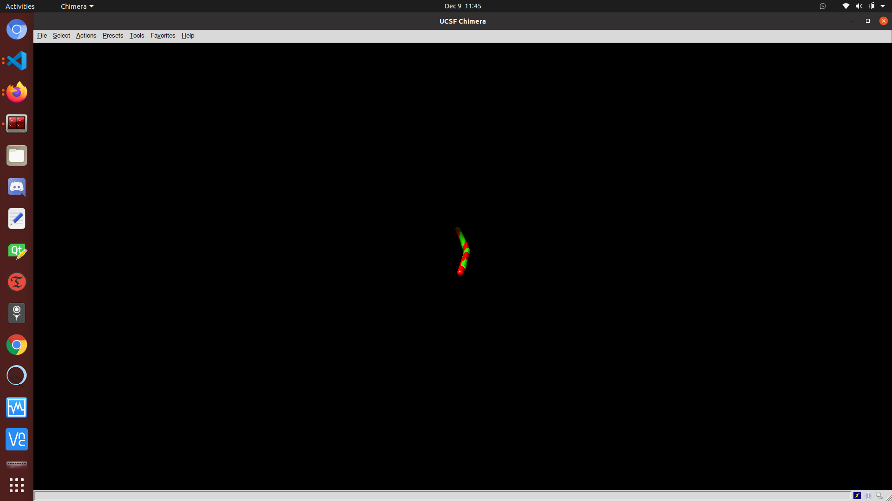
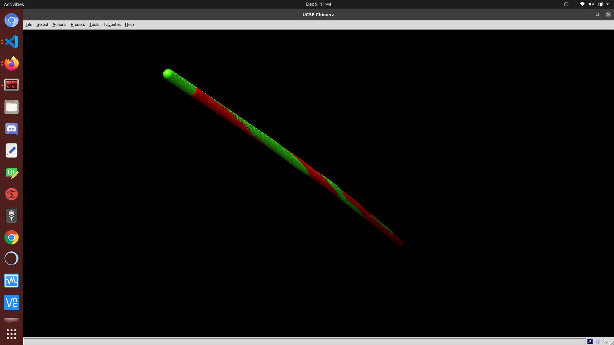

# Overview 

*For our solution to the problem of 3D point-set alignment, we provide
an implementation of the Iterative Closest Point (ICP) algorithm for 3D
point alignment. Our program, when run, will take in two helix-axis
protein database (PDB) files, convert the residue coordinates to 3-D
points and calculate the transformation matrix to transform one PCB into
another. Our program works on any PCD but results are strongest when the
two PCD's are transformations (similar geometry) of one another or are
helix axis. To accommodate point set's of varying sizes, we have
provided a filtering mechanism to pass through the denser of the two
point clouds and remove points so that they are of equal size. These
points are not removed from the resulting transformed PDB's, only the
array of 3-D points used to generate a transform. Our program utilizes
Biopython module in python3 to programmatically alter the coordinates
associated with each residue in the original PDB. This parameters
provided to the ICP were chosen from testing and remain optimized. As
the results show below, the registration of helices and helix-axis are
both strong and optimization could stand to render even tighter
alignments. The program could be extended for full automated alignment
of helices if a solution to compute helix axis' was provided to feed the
axis' into the algorithm.

NOTE: Please visit:
<https://colab.research.google.com/drive/1IYXW43aQeekV1W7goZX8XrZkBU4yzGAI?usp=sharing>
where a helix-axis transformation along with the required modules are
included for ease-of-viewing along with further instructions and code
explanations.*


## Sample outputs 

*The following is a visualization sequence of the algorithm. The images
are captured using UCSF's Chimera for protein visualization. We use
helix1-axis.pdb and helix2-axis.pdb with the intent to transform
helix1-axis onto helix2-axis. Figure 1 shows the two helices in Chimera
loaded with their initial residues coordinates. Because of their
relative distance, the rendered visualization is difficult to interpret
and thus we drew bounding elipses around each helix-axis. The subsequent
figures show multiple views of the scene in which the transformed
helix1-axis pdb was opened along with the helix2-axis. As is
demonstrated below, the icp algorithm proves to be an effective method
for the alignment of two helices. For reference, helix2-axis.pdb is
shown in red and helix1-axis.pdb(transformed) is show in green.*






## Running instructions for helix axis transformation. (Default files.) 

Please ensure the proper modules are installed, for full list and
interactive demo please see:
[https://colab.research.google.com/drive/1IYXW43aQeekV1W7goZX8XrZkBU4yzGAI?usp=sharing ](https://colab.research.google.com/drive/1IYXW43aQeekV1W7goZX8XrZkBU4yzGAI?usp=sharing )
where dependencies are listed in the top cell.* 
1) Run 'python3 ICPTransformation.py' 
2) ENTER 1 to use default test cases helix1-axis.pdb and helix2-axis.pdb, included already in the folder. 
3) View the transformation matrix in the terminal and helix1AxisTransform.pdb 
4) If desired, open Chimera and load helix2-axis.pdb. Then open helix1AxisTransform.pdb for visual
verification. 
5) In the terminal enter the helix pdb filepath associated
with helix-axis1. In this case, enter 'helix1.pdb'. This will apply the
transformation matrix to each residue coordinate in helix1.pdb as it did
to helix1-axis.pdb in step 2. 
6) Enter 'helix1.pdb' to apply the
transform to each residue coordinate in helix1.pdb. 
7) The transformed
helix is in fullHelix1Transformed.pdb. Open in chimera along with
helix2.pdb for viewing.

## Running instructions for helix axis transformation. (Custom files.) 

*Please ensure the proper modules are installed, for full list and
interactive demo please see:
[https://colab.research.google.com/drive/1IYXW43aQeekV1W7goZX8XrZkBU4yzGAI?usp=sharing ](https://colab.research.google.com/drive/1IYXW43aQeekV1W7goZX8XrZkBU4yzGAI?usp=sharing )
where dependencies are listed in the top cell.* 
1) Run 'python3
ICPTransformation.py' 
2) ENTER '2' and input the first and second helix axis files. The first will be transformed into the second. 
3) View the transformation matrix in the terminal and helix1AxisTransform.pdb 
4) If desired, open Chimera and load second helix axis file entered in step 2. Then open helix1AxisTransform.pdb for visual verification of the transformation. 
5) In the terminal enter the helix pdb filepath associated with helix-axis1. In this case, enter 'helix1.pdb'. This will apply the transformation matrix to each residue coordinate in helix1.pdb as it did to helix1-axis.pdb in step 2. 
6) Enter the file path of the
helix associated with helix axis 1 from step 2 to apply the transform to each residue coordinate in the full helix file. 
7) The transformed helix is in fullHelix1Transformed.pdb. Open in chimera along with helix2.pdb for viewing. NOTE: The two files fullHelix1Transformed.pdb and helix1AxisTransform.pdb are overwritten each run.
## Implementation Details 

*Below are the three methods used to calculate the best transformation
matrix for two sets of 3-D points. This algorithm is agnostic to PCD's
and takes two numpy arrays of 3-D points, A and B, to use in the
transformation. A catching mechanism was put in for 3-D points of
unequal lengths as can be seen on line 79. We filter the 3-D points to
be of equal length prior to using icp. The Iterative Closest Point
method finds best-fit transform that maps points A on to points B. The
final homogeneous transformation that maps A on to B is found using
Euclidean Distances for localization of points in conjunction with the
k- nearest neighbors method. The knn method finds the nearest euclidean
neighbor in dst for each point in src. As can be seen in the Driver
method beginning on line 264, the two helix-axis PDB's are passed to the
method PDBToNpy which convert the 3-D coordinates associated with each
residue. These numpy arrays are used as the agnostic 3-D point arrays
which icp requires and it is on these that we filter out points and
account for mismatches in size. The two numpy arrays are then passed
into the method TransformAllPoints which facilitates the prepossessing
of the numpy arrays and the hand off to the icp method. What is returned
into t3 on line 268 is a 4-D matrix consisting of the transformation and
rotation matrices. We use this transformation matrix to transform the
points using numpy in the CreatePDB method. This method also composes a
BioPython structure with the new coordinate transformations and outputs
a transformed PDB file that can be loaded into chimera or any desired
visualization software. After performing the transformation matrix and
transforming the helix axis', the program allows for the optional input
of the two helix files corresponding to the two helix axis'. Using the
transformation matrix applied in the prior steps, it will transform the
points of the helix file and output a transformed helix in the same
fashion as is done with the axis.*

``` {#lst:import .python language="Python" caption="Python sample code loaded from file" label="lst:import"}
import numpy as np
from sklearn.neighbors import NearestNeighbors
from numpy import load
from random import randint
from Bio import PDB
from numpy import asarray
from Bio.PDB import PDBParser
from Bio.PDB.PDBIO import PDBIO
from Bio.PDB.StructureBuilder import StructureBuilder
import numpy as np


class pdbTransform():
    def __init__(self):
        self.deletedIndex = []
    # Accepts pdb, returns numpy array
    def PDBToNPY(self, fpathin):
        parser = PDB.PDBParser()
        io = PDB.PDBIO()
        struct = parser.get_structure('1ABZ',fpathin)
        allcoords1 = []
        for model in struct:
            for chain in model:
                for residue in chain:
                    for atom in residue:
                        x,y,z = atom.get_coord()
                        cSet = []
                        cSet.append(x)
                        cSet.append(y)
                        cSet.append(z)
                        allcoords1.append(cSet)
        return allcoords1

    def best_fit_transform(self, A, B):
        '''
        Calculates the least-squares best-fit transform that maps corresponding points A to B in m spatial dimensions
        Input:
        A: Nxm numpy array of corresponding points
        B: Nxm numpy array of corresponding points
        Returns:
        T: (m+1)x(m+1) homogeneous transformation matrix that maps A on to B
        R: mxm rotation matrix
        t: mx1 translation vector
        '''

        assert A.shape == B.shape

        # get number of dimensions
        m = A.shape[1]

        # translate points to their centroids
        centroid_A = np.mean(A, axis=0)
        centroid_B = np.mean(B, axis=0)
        AA = A - centroid_A
        BB = B - centroid_B

        # rotation matrix
        H = np.dot(AA.T, BB)
        U, S, Vt = np.linalg.svd(H)
        R = np.dot(Vt.T, U.T)

        # special reflection case
        if np.linalg.det(R) < 0:
            Vt[m-1,:] *= -1
            R = np.dot(Vt.T, U.T)

        # translation
        t = centroid_B.T - np.dot(R,centroid_A.T)

        # homogeneous transformation
        T = np.identity(m+1)
        T[:m, :m] = R
        T[:m, m] = t

        return T, R, t


    def nearest_neighbor(self, src, dst):
        '''
        Find the nearest (Euclidean) neighbor in dst for each point in src
        Input:
            src: Nxm array of points
            dst: Nxm array of points
        Output:
            distances: Euclidean distances of the nearest neighbor
            indices: dst indices of the nearest neighbor
        '''

        assert src.shape == dst.shape

        neigh = NearestNeighbors(n_neighbors=1)
        neigh.fit(dst)
        distances, indices = neigh.kneighbors(src, return_distance=True)
        return distances.ravel(), indices.ravel()


    def icp(self, A, B, init_pose=None, max_iterations=20, tolerance=0.001):
        '''
        The Iterative Closest Point method: finds best-fit transform that maps points A on to points B
        Input:
            A: Nxm numpy array of source mD points
            B: Nxm numpy array of destination mD point
            init_pose: (m+1)x(m+1) homogeneous transformation
            max_iterations: exit algorithm after max_iterations
            tolerance: convergence criteria
        Output:
            T: final homogeneous transformation that maps A on to B
            distances: Euclidean distances (errors) of the nearest neighbor
            i: number of iterations to converge
        '''

        assert A.shape == B.shape

        # get number of dimensions
        m = A.shape[1]

        # make points homogeneous, copy them to maintain the originals
        src = np.ones((m+1,A.shape[0]))
        dst = np.ones((m+1,B.shape[0]))
        src[:m,:] = np.copy(A.T)
        dst[:m,:] = np.copy(B.T)

        # apply the initial pose estimation
        if init_pose is not None:
            src = np.dot(init_pose, src)

        prev_error = 0

        for i in range(max_iterations):
            # find the nearest neighbors between the current source and destination points
            distances, indices = self.nearest_neighbor(src[:m,:].T, dst[:m,:].T)

            # compute the transformation between the current source and nearest destination points
            T,_,_ = self.best_fit_transform(src[:m,:].T, dst[:m,indices].T)

            # update the current source
            src = np.dot(T, src)

            # check error
            mean_error = np.mean(distances)
            if np.abs(prev_error - mean_error) < tolerance:
                break
            prev_error = mean_error

        # calculate final transformation
        T,_,_ = self.best_fit_transform(A, src[:m,:].T)

        #return T, distances, i
        return T
    # Accepts two numpy arrrays
    def TransformAllPoints(self, coord1,coord2):
        #global deletedIndex
        # Ensure they are the same size
        #coord1 = list(load(fname1))
        #coord2 = list(load(fname2))
        coord1Copy =[] #coord1
        coord2Copy =[]# coord2
        for c in coord1:
            coord1Copy.append(c)
        for c in coord2:
            coord2Copy.append(c)        
        #print("Point total of pdb1: " +str(len(coord1)))
        #print("Point total of pdb2: " +str(len(coord2)))
        if len(coord1Copy) != len(coord2):
            print("\nResolving PDB size difference...")
            if len(coord1) > len(coord2):
                diff = len(coord1) - len(coord2)
                # assume shape is same, density is diff
                for i in range(diff):
                    randInd = randint(0,len(coord1))
                    del coord1[randInd]
                    self.deletedIndex.append(randInd)
            else:
                diff = len(coord2) - len(coord1)
                # assume shape is same, density is diff
                for i in range(diff):
                    randInd = randint(0,len(coord2))
                    del coord2[randInd] 
                    self.deletedIndex.append(randInd)
        
            #print("Point total of pdb1: " +str(len(coord1Copy)))
            #print("Point total of pdb2: " +str(len(coord2Copy)))
        
        # (A,B)
        print("\nCalculating transformation matrix...")
        T = self.icp(np.array(coord1),np.array(coord2))

        coord1Adjust = []
        for coord in coord1Copy:
            tempList = coord
            tempList.append(1)
            coord1Adjust.append(np.array(tempList))
        coord2Adjust = []
        for coord in coord2Copy:
            tempList = coord
            tempList.append(1)
            coord2Adjust.append(np.array(tempList))

        # Print side by side

        #print("Point total of pdb1: " +str(len(coord1Adjust)))
        #print("Point total of pdb2: " +str(len(coord2Adjust)))
        
        #np.dot(T,coord1[0])

        print("Transformation matrix:\n"+str(T))
        #print("Length of coord1 "+str(len(coord1Adjust)))
        #print("Length of coord1 "+str(len(coord2)))
        #print("Length of coord 1 adjust: "+str(len(coord1Adjust)))
        #print("Length of coord 2 adjust: "+str(len(coord2Adjust)))
        coord1 = np.array(coord1Adjust)
        coord1T = []
        #print(coord1Copy)
        print(coord1T)
        for coord in coord1Copy:
            #print(coord)
            coord1T.append(np.dot(T,coord))

        coord1T.reverse()
        with open('ATrans_1.txt', 'w') as f:
            for item in coord1T:
                f.write("%s" % str(item.tolist()[0])+","+str(item.tolist()[1])+","+str(item.tolist()[2])+","+str(item.tolist()[3])+"\n")
        B = np.array(coord2).tolist()
        with open('B_1.txt', 'w') as f:
            for item in B:
                f.write("%s\n" % str(item))
        return (coord1T,T)
    def CreatePDB(self,coordArray,fPath, ofile):
        sloppyparser = PDBParser(PERMISSIVE = True, QUIET = True) 
        structure = sloppyparser.get_structure("MD_system", fPath)
        print("\nGenerating PDB file...")
        sb = StructureBuilder()
        sb.set_header(structure.header)
        # Iterate through models
        for i in range(len(list(structure.get_models()))):
            # Iterate through chains
            models = list(structure.get_models())
            counter = 0
            for j in range(len(list(models[i].get_chains()))):
                chains = list(models[i].get_chains())
                #Iterate thgouth residues
                for k in range(len(list(chains[j].get_residues()))):
                    #Iterate through 
                    residues = list(chains[j].get_residues())
                    for l in range(len(list(residues[k].get_atoms()))):
                        #Set coord for each
                        for atom in structure[i][chains[j].id][residues[k].id].get_atoms():
                            structure[i][chains[j].id][residues[k].id][atom.id].set_coord(np.array((float(coordArray[counter][0]),float(coordArray[counter][1]),float(coordArray[counter][2]))))
                            #print(structure[i][chains[j].id][residues[k].id][atom.id].get_vector())
                        counter += 1
        io=PDBIO()
        io.set_structure(structure)
        io.save(ofile)
        print("Transform file written to: "+ ofile)
    def TransformHelices(self, fpath1, T):
        c1 = self.PDBToNPY(fpath1)
        
        coord1T = []
        for coord in c1:
            coord.append(1)
            coord1T.append(np.dot(T,coord))
        coord1T.reverse()
        self.CreatePDB(coord1T,"helix1.pdb","helix1Transformed.pdb")
    def TransformFullHelices(self, fpath1, T):
        c1 = self.PDBToNPY(fpath1)
        
        coord1T = []
        for coord in c1:
            coord.append(1)
            coord1T.append(np.dot(T,coord))
        coord1T.reverse()
        self.CreatePDB(coord1T,fpath1,"fullHelix1Transformed.pdb")
        print("Full helix transformed and written to: fullHelix1Transformed.pdb")

    def Driver(self,fpath1="helix1-axis.pdb",fpath2="helix2-axis.pdb"):
        c1 = self.PDBToNPY(fpath1)
        #print(c1)
        c2 = self.PDBToNPY(fpath2)
        t3 = self.TransformAllPoints(c1,c2)
        self.CreatePDB(t3[0],fpath1,"helix1AxisTransform.pdb")
        return t3
        '''
        while True:
            print("Enter 1 use default helices, enter 2 to enter custom.")
            choice = input('')
            if choice == "1":
                self.TransformHelices("helix1.pdb",t3[1])
            #elif choice == "2":
        '''
def main():

    print("**********Helix axis Transformation**********")
    choice = input("ENTER 1 to use default test cases helix1-axis.pdb \nand helix2-axis.pdb.\nENTER 2 to input custom pdb files.\nOption: ")
    transformObj = pdbTransform()
    if choice == "1":
        transform = transformObj.Driver()
        print("**********Full helix Transformation**********")
        helix1Path = input("Enter the helix pdb filepath assosciated with helix-axis1: ")
        transformObj.TransformFullHelices(helix1Path,transform[1])
    elif choice == "2":
        try:
            fpath1 = input("Enter fpath of helix-axis1: ")
            fpath2 = input("Enter fpath of helix-axis2: ")
            transform = transformObj.Driver(fpath1,fpath2)
            print("**********Full helix Transformation**********")
            helix1Path = input("Enter the helix pdb filepath assosciated with helix-axis1: ")
            transformObj.TransformFullHelices(helix1Path,transform[1])
        except:
            print("File not found!")
if __name__ == "__main__":
    main()
```
# References 

-   GitHub, <https://github.com/rmslick/HelixAxisRegistration.git>

-   Colab,
    <https://colab.research.google.com/drive/1IYXW43aQeekV1W7goZX8XrZkBU4yzGAI?usp=sharing>
